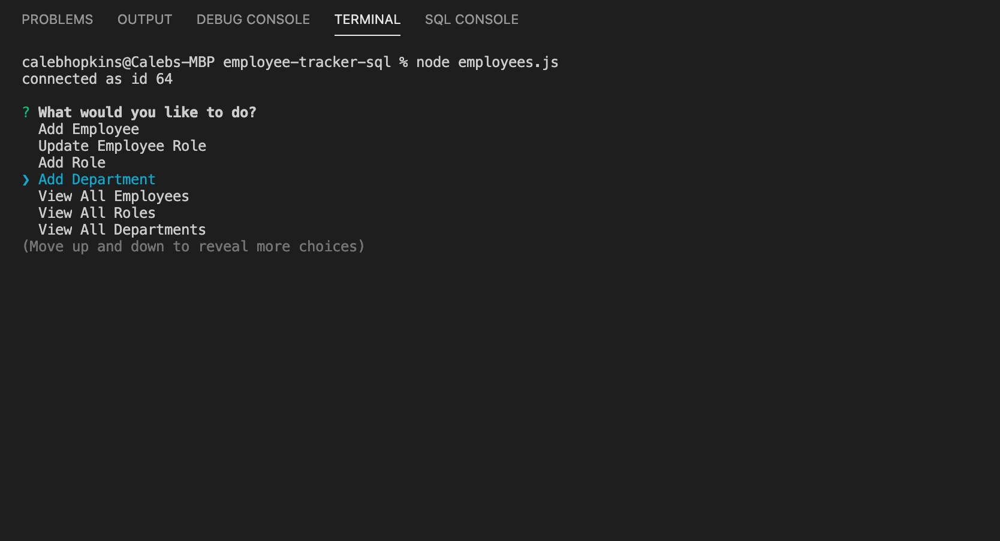

# Employee Tracker SQL

This application is a command line interface program to make it easy for employers to keep track of their employee rosters.

## Installation

* `npm install` in your `terminal`
* copy `schema.sql` contents to `MySQL Workbench` and execute the contents.
* `node employees.js` in your terminal

## Instructions

1) After installation, run `node employees.js` in your command line.
2) Answer the questions.
3) When you're done, select the `Quit` option.

## Screenshot

## Questions

For any questions, please contact me at:

**Email:** calebhopkins@outlook.com

**GitHub Profile:** [CalebTheCreative]("https://github.com/CalebTheCreative")